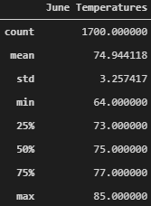
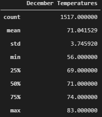

# Surfs Up
## Overview
This project seeks to understand the weather on the Hawaiian island of Oahu. The client will use the results of this analysis to determine whether a surf and ice cream shop is a sustainable year round business. For the purpose of this project, the months of June and December were analyzed. 
## Results

The following tables describe the temperature data for June and December.

When examined side-by-side, June and December appear to have high (max) and average (mean) temperature ranges within two degrees of each other. The low temperatures differ by about 8 degrees. 

## Summary
  1. Since the average temperature on Oahu does not change by more than 5 degrees yearround, the ice cream and surf shop can be a sustainable business during all parts of the year. 
  2. Something to consider for future analysis needs to be amount of precipitation based on the geographical location within the island. While the island itself may have consistent temperatures throughout the year, temperatures and precipitation may vary more based on specific location. 
  3. Spring and Autumn temperatures and precipitation should be looked at as well to gain a deeper understanding of how the weather looks throughout the year.
